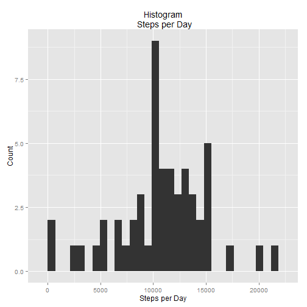
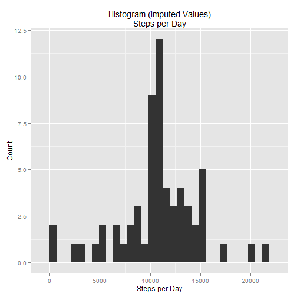

# Reproducible Research: Peer Assessment 1


## Loading and preprocessing the data


```r
library(ggplot2)

setwd("~/My Dropbox/Education/ReproducibleResearch/RepData_PeerAssessment1")
data <- read.csv(file="./Data/activity.csv", stringsAsFactors= F)
data$date <- as.Date(data$date)
```


## What is mean total number of steps taken per day?


```r
stepPerDay <- tapply(X=data$steps, INDEX=data$date, FUN=sum)
stepPerDay <- as.data.frame.array(x=stepPerDay)           

ggplot(data=stepPerDay, aes(x=stepPerDay)) + geom_histogram() + 
        xlab(label= "Steps per Day") + ylab(label= "Count") +
        ggtitle(label= "Histogram\n Steps per Day")
```

```
## stat_bin: binwidth defaulted to range/30. Use 'binwidth = x' to adjust this.
```

 

```r
mean(stepPerDay$stepPerDay, na.rm=T)
```

```
## [1] 10766
```

```r
median(stepPerDay$stepPerDay, na.rm=T)
```

```
## [1] 10765
```

## What is the average daily activity pattern?


```r
meanPerInt <- aggregate.data.frame(x= data[ , 1], 
                                   by= list(data$interval), 
                                   FUN= mean, na.rm= T)
names(meanPerInt) <- c("interval", "meanSteps")

ggplot(data=meanPerInt, aes(x=interval, y=meanSteps)) + geom_line()
```

 

```r
max(meanPerInt$meanSteps)
```

```
## [1] 206.2
```


## Imputing missing values

Simply fill the missing values in the original data set with the mean   values from new table created in the preceeding step!

Compute number of missing observations

```r
length(which(complete.cases(data)== F))
```

```
## [1] 2304
```

add rounded mean step per interval for imputation


```r
meanPerInt$meanStepsR <- round(x=meanPerInt$meanSteps, digits=0)
head(meanPerInt)
```

```
##   interval meanSteps meanStepsR
## 1        0   1.71698          2
## 2        5   0.33962          0
## 3       10   0.13208          0
## 4       15   0.15094          0
## 5       20   0.07547          0
## 6       25   2.09434          2
```

make data subset of NA observations with rounded average taken from  
meanPerInt frame


```r
iData <- merge(x=data[which(is.na(data$steps)), ], 
               y=meanPerInt[, c(1,3)])[, -2]
iData <- iData[, c(3,2,1)] #reorder for rbind
names(iData) <- names(data) #rename for rbind
head(iData)
```

```
##   steps       date interval
## 1     2 2012-10-01        0
## 2     2 2012-11-30        0
## 3     2 2012-11-04        0
## 4     2 2012-11-09        0
## 5     2 2012-11-14        0
## 6     2 2012-11-10        0
```

rbind imputed data with original complete data


```r
nData <- rbind(data[which(!is.na(data$steps)), ], iData)
nData <- nData[order(nData$date, nData$interval), ] #reorder
```

Make Histogram with new data

```r
nStepPerDay <- tapply(X=nData$steps, INDEX=nData$date, FUN=sum)
nStepPerDay <- as.data.frame.array(x=nStepPerDay) 

ggplot(data=nStepPerDay, aes(x=nStepPerDay)) + geom_histogram() + 
        xlab(label= "Steps per Day") + ylab(label= "Count") +
        ggtitle(label= "Histogram (Imputed Values)\nSteps per Day")
```

```
## stat_bin: binwidth defaulted to range/30. Use 'binwidth = x' to adjust this.
```

 

```r
mean(nStepPerDay$nStepPerDay)
```

```
## [1] 10766
```

```r
median(nStepPerDay$nStepPerDay)
```

```
## [1] 10762
```

## Are there differences in activity patterns between weekdays and weekends?
